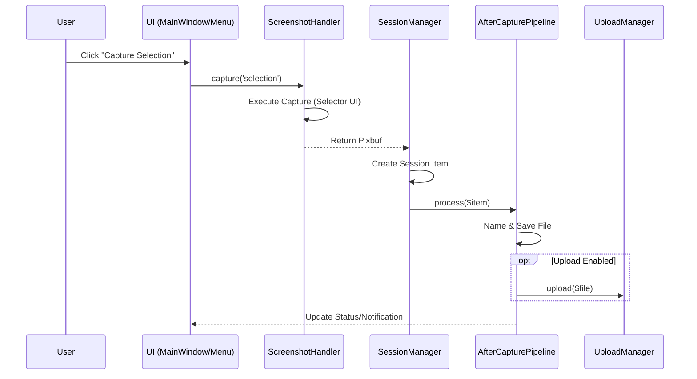

# Life of a Screenshot

This document traces the temporal flow of a screenshot capture in the modern Shutter architecture.

## 1. Initiation
The user interacts with the UI (e.g., clicking "Selection" in the main window or tray icon).

*   **Trigger:** `Shutter::App::UI::Menus` or `Shutter::App::UI::MainWindow`.
*   **Action:** Calls `Shutter::App::Core::ScreenshotHandler->capture('selection')`.

## 2. Capture Execution
The `ScreenshotHandler` coordinates the actual capture process.

*   **Logic:** `Shutter::App::Core::ScreenshotHandler`.
*   **Sub-Task:** Launches the specific selector UI (e.g., `Shutter::Screenshot::SelectorAdvanced`).
*   **Outcome:** A GdkPixbuf of the captured region is created.

## 3. Session Integration
Once the capture is complete, it must be added to the current session.

*   **Logic:** `Shutter::App::Core::SessionManager`.
*   **Action:** `add_to_session($pixbuf)`. This creates a new "tab" in the UI and manages the underlying file state.

## 4. After-Capture Pipeline (The "Workflow")
The captured image passes through a user-configurable pipeline.

*   **Logic:** `Shutter::App::AfterCapturePipeline`.
*   **Steps:**
    1.  **Naming:** Generates a filename based on patterns (e.g., `%Y-%m-%d_%H%M%S.png`).
    2.  **Saving:** `Shutter::Pixbuf::Save` writes the file to disk.
    3.  **Resizing/Effects:** Applies any automatic transformations.
    4.  **Uploading:** If enabled, `Shutter::App::Core::UploadManager` is triggered.
    5.  **Notifications:** `Shutter::App::Notification` alerts the user.

## 5. UI Update
The main window refreshes to show the new screenshot and its current status.

*   **Logic:** `Shutter::App::UI::MainWindow`.
*   **Action:** Updates the thumbnail list and status bar.

---

## Visual Summary

